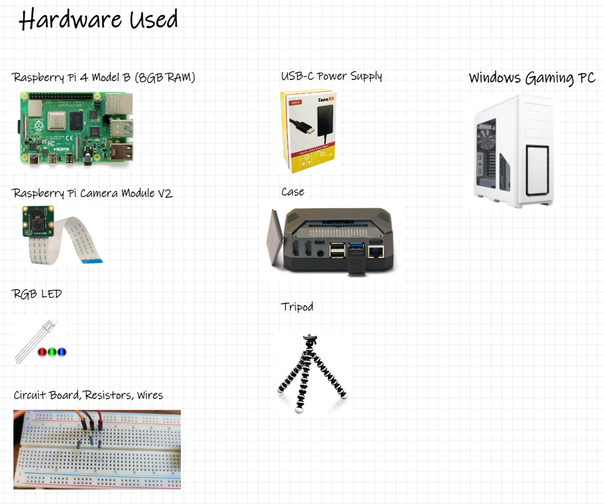

# 1. Table of Contents
- [1. Table of Contents](#1-table-of-contents)
- [2. Project Overview](#2-project-overview)
- [3. Equipment](#3-equipment)
- [4. CNN Model](#4-cnn-model)
- [5. Repo Structure](#5-repo-structure)
  - [5.1 Scripts](#51-scripts)
    - [5.1.1 Training (host)](#511-training-host)
    - [5.1.2 Inference (rpi)](#512-inference-rpi)

# 2. Project Overview

[Click here to watch project demo](https://youtu.be/ypYA49lTtVg)


# 3. Equipment


# 4. CNN Model


# 5. Repo Structure

```
├── docs
│   ├── cnn.png
│   ├── hardware.png
│   └── high_lvl_overview.png
├── src
│   ├── host
|   |    ├── create_image_db.py
|   |    └── train_cnn.py
│   ├── input
|   |    └── images
│   |         ├── training
|   |         |    └── .keep
|   |         └── validation
|   |              └── .keep
│   ├── output
|   |    └── .keep
│   └── rpi
|        └── predict.py
└── README.md
```

## 5.1 Scripts

### 5.1.1 Training (host)

```bash
python create_image_db.py
```
intent: Mapping the target labels to the images --> Want to input this data to the model

```bash
python train_cnn.py
```
intent: Process the dataset, create the NN, then train the model --> Want to send the model to the raspberry pi

### 5.1.2 Inference (rpi)

```bash
python predict.py
```
intent: Start the app and run the model
